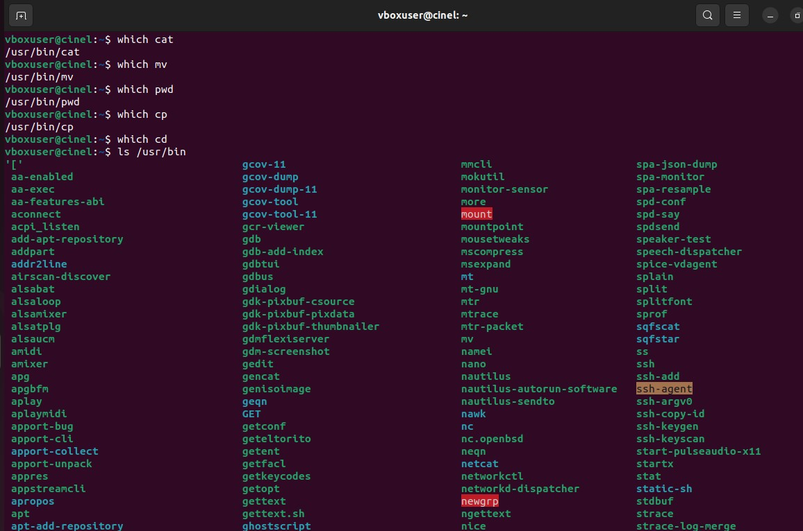
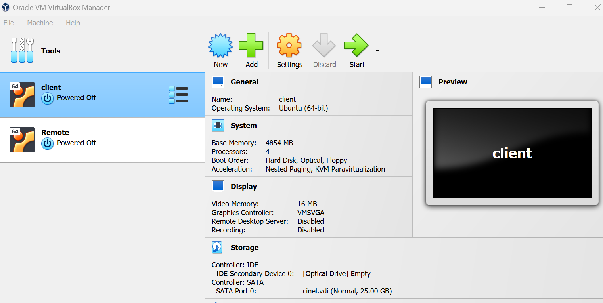
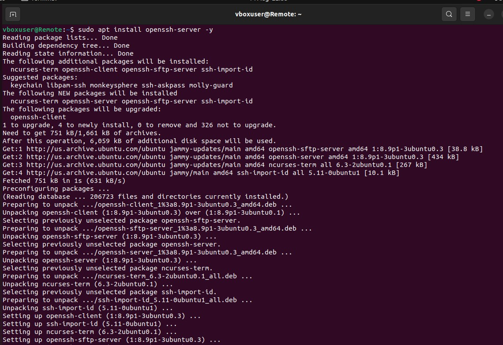
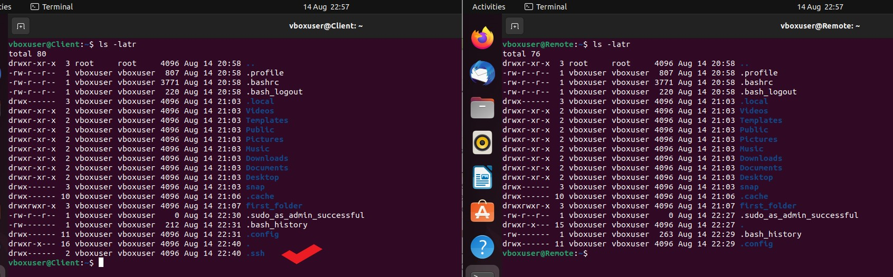
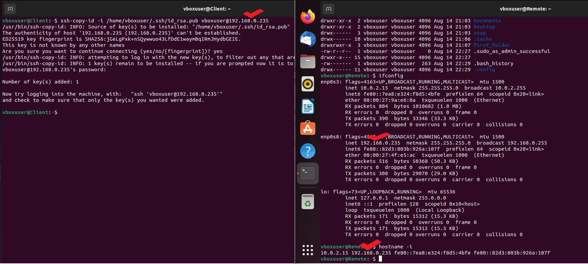
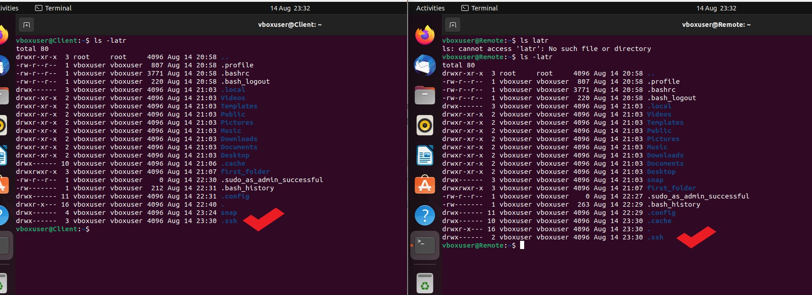
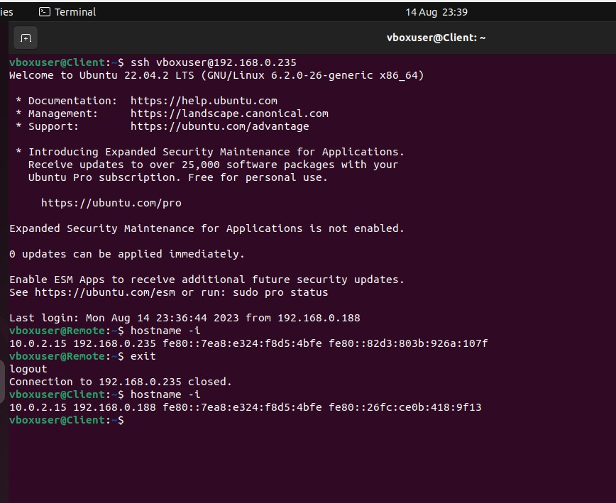
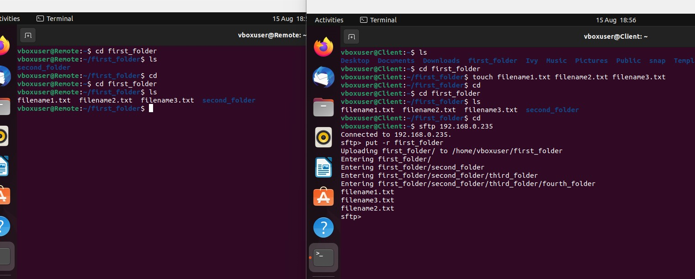

# LINUX ADMINISTRACTION

* **-P** - stands for flags in cmd line 
* **sudo** – used to install for root users
* **bin** – stores binary files in linux 
* **/** - means root 
* **su** – switch user 
* **Hostname -i** – to get the ip address 
* **chown** – change owner
* **cat** cmd helps you to view the contents in the file
* **which ls** – this cmds tells you the location of the ls cmds
* **hich pwd** – same applies
* **-r** – recursive cmd used to add multiple folders, only to be used when working with folders
* **useradd** – add user
* **SFTP** – Secure File Transfer Protocol
* **SCP** – Secure Copy Protocol
* **ls /usr/bin** - show which commands can be found in the bin.



## LINUX DIRECTORY
* **mkdir** – to create folders or directories in linux 
* **ls** – list folders or files 
Nested folders are folders created inside another folders 
* **tree** - is a recursive directory listing program that produces a depth-indented listing of files
* **sudo vi /etc/sudoers** - used for users management setting, grant users access privilege, as **_etc_** stores configuration information.

To check tree directory in linux we need to first install tree directory using the below cmds

`sudo apt-get install tree`

Create folders using the below cmds

`mkdir -p /filename1/filename2/filename3/`

The above cmds can be used to create all three folders in a directory and this will be nested where we have parent and child folders, 
Run the below cmds to see the tree display of the folders and how they are nested:

`tree filename1`

Using the tree directories we have levels of directory which is represented by the letter **L**, to see level one/two directories, run the below.
```
Tree / -L 1 – level 1
Tree / -L 2 – level 2
```


## OPENSSH IN LINUX
OpenSSH (also known as OpenBSD Secure Shell) is a suite of secure networking utilities based on the **Secure Shell (SSH) protocol**, which provides a secure channel over an unsecured network in a client–server architecture/connection, as this can be used to securely communicate with different servers.

## Cloning of server, 

In this project I will be using an Oracle VM, 
To start the project I powered off my Terminal, and cloned the terminal, named one as a client and the other remote as this will differentiate both terminals for easy identification.

Set up the network using adapter 2 on each of the host and setting it to bridged network on both host.



However the names did not show up on the terminal so it is required that I change the host name manually on the terminal using the below cmds:

`sudo vi /etc/hostname`

I renamed the hosts to client and remote.
At this point I have two servers/host and would want both to communicate to each other.

First if you have previously generated an **ssh key** you dont need to generate it again, you can share the public key **(.ssh_rsa.pub)** but in my case I don’t have the .ssh key so I will need to generate a new .ssh key on the host as this will allow for communication of both server since they will be sharing same public key.
On the client terminal run the below cmd:

`ssh-keygen`

To confirm the key has been generated 

`ls -latr /.ssh –`

On the remote server we need to install OPENSSH using the below cmd, because without the openssh tool install the both server cannot communicate or share information

`sudo apt install openssh-server -y`



Confirmed that the .ssh key is only on the client server as that is where the key was generated by running the below cmd

`ls -latr`



But the .ssh public key in the client sever needs to be shared with the remote server to enable communication of both server, to make this happen, first get the ip address of the remote server, so you can either run the below cmds
```
ifconfig
or
hostname -i
```
The above cmd will give the ip address to use in the below cmd as this will send a copy of the .ssh public key from the client host to the remote host.

`ssh-copy-id -I /home/vbosuser/.ssh/id-rsa.pub vboxuser@<ip_address_for_remote_server>`



After that must have run successfully, you can confirm to see the .ssh public key in the remote server and client server bu running the below cmds.

`ls -latr`



For the client server to login/access the remote server, run the below cmds from the client server:

`ssh vboxuser@<remoteserveripaddress>`



**N/B:** This can also be applied to other VMs, for instance you can also use the AWS EC2 instance what is required is that you have to create two instances and follow up with the connection just as I have explained above. 

## Transfering Files/Images/Videos between Host.
In this project I created a couple of .txt files using the touch command on the client server and these files are saved in a folder call first_folder, and also created a folder named first_folder on the remote server as that will be pointing ot same name folder in the remote host.
To share the contents of this folder (first_folder) with the remote we I used the **SFTP method**.

Using the SFTP method, connect to the remote sever by running the below cmd:

`sftp vboxuser@<remote_ip_address>`

After the above command you run the below to create a copy of the content or share the contents of the folder to the remoter server.

`put -r <first_folder>`



We used the **_put_** cmd since we are sending the files to teh remote, but in a case where we need to receive or move the files from the remote we use **_get_** cmd.

`get -r <name_of_folder>`

## Process state in Linux
**R - Runnable state** - this state has all the resource to run but the CPU is not availiable.

**R - Running state** - happen when a process is running on the CPU

**S - Sleeping state** - Is when a process needs resources that are not currently available
* **S - Interruptable sleep** - when the process is waiting either for a particular time slot or for a particular event to occur.
* **D - Uninterruptable sleep** - Is one that won't handle a signal right away. it will wake only as a result of a waited upon resources becoming availiable or after a time-out occurs during that wait.

**Z - Defunct/Zombie state** - I when the parent process dies befroe the child process.


**_Thank you_**